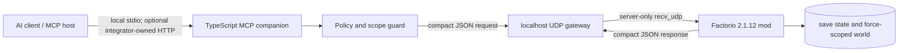

# Sceatorio AI/MCP architecture and security specification v1

Status: local Lua/stdio implementation and live Factorio gate complete, 2026-08-01.

This document defines the security boundary and product behavior for Sceatorio's vendor-neutral MCP interface. Claude is one supported MCP host; protocol identities, technology names, settings, and save data remain provider-neutral. The canonical executable schemas are in [`mcp/src`](../mcp/src), while [`src/core/aiConstants.lua`](../src/core/aiConstants.lua) is the Factorio-side capability source of truth.

## Product boundary

An MCP client such as Claude can act as factory intelligence. The human remains the character and approves physical construction.

V1 provides low-level telemetry, bounded event waiting, structured blueprint analysis and player-controlled delivery, dedicated circuit input/output ports, and private annotations. It does not provide character movement, mining, crafting, combat, teleportation, direct entity creation or deletion, arbitrary ghost placement, arbitrary Lua/RCON, train-schedule mutation, recipe mutation, or logistic-request mutation.

This boundary supports friendly independent factories: each player can improve the monitoring loops, calculations, blueprints, and circuit interfaces around their own base without automating the character. The API intentionally omits convenience tools such as `diagnose_bottleneck` and `build_optimal_smelter`.

## Components and trust boundaries

- The MCP companion performs policy and scope checks. The shipped local stdio path consumes a grant created by the one-time pairing exchange; an external HTTP deployment must add its own standards-compliant authentication layer.
- The sidecar and the Factorio headless process run on the same trusted host, ideally under a dedicated operating-system account or container.
- Factorio UDP is bound to localhost. It is not an internet-facing authentication boundary.
- The Factorio mod resolves the opaque `bindingId` to authoritative save/player/force state and re-checks every asserted scope before reading the world.
- A short-lived, single-use pairing code crosses loopback UDP once and is consumed before binding validation. The production GUI flow never persists the code in the save or writes it to logs. The explicitly enabled development-only RCON fixture does return a test code in command output and must remain disabled on production servers. Bearer tokens, refresh tokens, API keys, and authorization-server secrets never enter UDP packets, the Factorio save, settings, blueprints, or Mod Portal artifacts.

Factorio synchronizes incoming UDP data as multiplayer input actions. Other peers and mods may therefore observe payloads, which is why the pairing value is one-time and short-lived and all later packets contain only scoped identifiers plus bounded request data. The UDP socket must remain loopback-only.

## Layered enablement and configuration

AI assistance is off by default. Access is the intersection of all three layers:

1. **Server policy:** an administrator explicitly enables the Factorio gateway and sets allowed capabilities, per-player rates, and save-wide total and expensive request rates. The TypeScript companion separately bounds request timeouts; page size, event-ring, and blueprint limits are fixed implementation constants. A binding has no lifetime constant at all — nothing retires it but revocation.
2. **Force technology:** the single `AI Assistance` technology costs only automation science and unlocks the powered Uplink plus dedicated input/output ports. A force unlock never opts a human in.
3. **Pairing grant:** a short-lived, single-use code from a powered Uplink binds one local MCP subject to one human, save, force, team, and explicit surface grants. The player can revoke bindings from the Uplink GUI.

One logical quota follows the human even when they connect several Claude clients. Tokens are per human, not per force. Two atomic save-wide fixed-window counters separately limit total and expensive requests without resetting or bypassing the per-human counters. No bearer token is represented as a Factorio mod setting.

The Factorio capability list and setting defaults come from [`aiConstants.lua`](../src/core/aiConstants.lua); the TypeScript policy defaults in [`capabilities.ts`](../mcp/src/domain/capabilities.ts) preserve the same fail-closed behavior.

## Scope model

An access grant contains:

- Local MCP principal and token identifiers, or externally validated subject identifiers in an integrator-owned HTTP deployment.
- Opaque Factorio binding ID.
- Save, player, force, and team IDs.
- The effective capability set.
- Explicit authorized surfaces.
- Player preferences, issuance time, and revocation state. A grant carries no expiry; revocation is the only end state.

Clients never provide `saveId`, `playerId`, or `forceId` as tool arguments. The sidecar injects those fields from the validated grant. A requested `surfaceId` must appear in that grant and must still belong to the paired force when Factorio executes the request.

Surface grants are not restricted to the original Nauvis spawn. A fresh pairing descriptor can include team-owned secondary planet spawns and eligible force-owned space-platform surfaces already known at pairing time, which is required for Space Age. Grants are immutable for the life of a pairing: after authoritative access to a new planet or platform, the player creates a new one-time pairing, which revokes the old binding and returns a descriptor containing the new surface. A caller cannot grant itself a surface by naming it.

## Visibility and anti-cheat rules

- Map and resource results come only from chunks charted by the paired force.
- Enemy information is limited to current force visibility. Older observations may be returned only as clearly timestamped, last-seen cache entries.
- Entity, logistic, rail, electric, and circuit queries must match both force and authorized surface.
- Opaque entity/network IDs are scoped to a save and world revision. They are not accepted after invalidation.
- Space Age remote surfaces use the same force-chart rule; expansion does not broaden access to another force's chart.
- Responses include game tick and monotonic world revision so Claude can detect stale joins between calls.

## Blueprint behavior

The flagship workflow is a structured request such as a compact stone-furnace array with a target output. Claude queries recipes and prototypes, calculates a layout, validates it, reads objective analysis, iterates, and finally calls `save_blueprint`.

The MCP side accepts structured entities, tiles, bounded wire references, and expected outputs. It also accepts the fields a real Factorio build needs: module requests as a plain item-to-count map, item filters with an optional filter mode, splitter lane priorities, logistic request filters, and a bounded control-behavior object covering circuit and logistic conditions, read and enable modes, arithmetic and decider combinator parameters, and constant combinator signal sections. Arbitrary `settings` blobs remain rejected; every accepted field is a named, documented, individually validated key. The client is not asked to hand-author compressed blueprint Base64.

Factorio validates entity/tile prototypes, quality, recipe/category/unlock state, connection targets, wire names, and a numeric connector-ID range. It resolves every requested module against the target prototype's module inventory size, allowed module categories, and allowed effects; every filter and request-filter item against the item prototypes and the entity's filter slot count; and every signal against the item, fluid, and virtual-signal prototypes, rejecting unknown operators, comparators, and read modes. It computes build-item cost including requested modules and can run an optional non-mutating entity-placement collision check. It does not prove that a specific prototype supports a requested connector, simulate tile collisions, or analyze whole-factory connectivity.

A layout holds at most 400 entities and 512 tiles, and its canonical encoding at most 44 KiB. The binding constraint is the 48 KiB gateway request datagram rather than the count: a measured plain entity costs about 98 JSON bytes and a tile about 58, so a layout is rejected with its measured size before it reaches the socket. The mod persists only this documented whitelist; unknown keys are tolerated by validation for forward compatibility but are never written to the save.

`save_blueprint` means:

1. Save a new immutable record in the paired player's mod-owned AI library. V1 records use revision `1`; the field is reserved for future compatible evolution rather than implying update history.
2. Expose that virtual record through the mod-owned per-player AI Blueprint Inbox.
3. Copy it to the paired player's cursor only when the caller explicitly requests cursor delivery.
4. Never place ghosts or entities automatically.

Factorio mods cannot write directly to the persistent native **My Blueprints** shelf. The player can use the normal Factorio action to move a cursor-delivered blueprint there. The bounded per-player in-save library retains the newest 100 immutable records within a 512 KiB canonical-layout budget, evicting oldest records first, without pretending to bypass this API restriction.

## Circuit writes and annotations

`write_control_port` is the only factory-control primitive. It can change only a player-built, force-owned AI output port. Lua enforces at most 32 signals, at least five seconds between writes, TTL-based clearing, and a visible last-change marker. The player must wire those signals to their own machinery.

Annotations are private to the paired human, bounded in length and lifetime, and restricted to an authorized surface. Neither feature grants generic entity mutation.

## Performance and fairness

- Every list operation is paginated; server policy can lower the schema maximum.
- Spatial scans are bounded to 1024 by 1024 tiles per call and use bounded Factorio queries plus a 2,000-entry O(1) entity-reference ring rather than recurring full-surface scans. Entity build/removal hooks do no AI cache or binding work while the server-global AI policy is off; a later authorized lookup falls back to Factorio's unit-number index and repopulates the cache lazily.
- Prototype and recipe results are cacheable by mod set and game version.
- `wait_for_events` supports persistent Claude Code or Agent SDK loops without high-frequency polling. Wait registration consumes both normal and expensive per-player quota, and the 256-entry queue is checked round-robin in slices of at most 16 waits every six ticks. A wait scans the 512-entry event ring only after the global event cursor advances or its deadline is due.
- Event rings and response pages have bounded retention; cursors are validated and cannot broaden force or surface visibility.
- Per-player fixed-window quotas apply equally across clients. Event waits, expensive scans, and blueprint validation have a separate fixed-window budget. Save-wide total and expensive fixed-window budgets are also checked before any counter is incremented, so a rejected request cannot partially consume another quota.
- Exact operation retries are bounded to 64 cached responses, 512 KiB, and ten game minutes per player/binding. Authorization is rechecked before cache lookup, and a conflicting payload cannot reuse a UUID.
- Pairing replay is module-local and bounded to 64 responses, 512 KiB, and five game minutes; UUID conflicts are rejected before consuming a one-time code.
- UDP datagrams are capped at 48 KiB in v1. Oversized layouts must be reduced or wait for a future chunked transfer revision.
- Logistic and construction robot performance policy belongs to gameplay settings, not to this MCP bridge. Telemetry exposes robot counts so server policy can be evaluated without adding per-tick scans.

## Transport and failure model

Factorio 2.1.12 exposes `helpers.send_udp`, `helpers.recv_udp`, and `on_udp_packet_received` when the process starts with `--enable-lua-udp=<port>`. The official docs note a 256 KiB receive buffer, packet loss while paused/saving or between drains, and multiplayer synchronization overhead. The gateway therefore uses compact requests, UUID correlation, hard timeouts, bounded payloads, and explicit retryability. Mutations are not blindly retried.

UDP responses from an unknown address or source port are ignored. The Lua listener accepts only server-instance packets (`player_index == 0`) and replies with `helpers.send_udp(source_port, ..., 0)`. A dedicated server should use Factorio 2.1.12; the headless `recv_udp(0)` crash reported in 2.1.9 was marked fixed for the next release.

## Deployment modes

- **Local development / MCP hosts such as Claude Code:** stdio launches the companion. The checked-in pairing CLI exchanges the Uplink's one-time code and emits the local access-grant JSON used by the stdio process.
- **Unshipped multiplayer target:** an operator-supplied stateless Streamable HTTP service could sit behind an OAuth 2.1 resource-server layer, validate issuer, audience, expiry, revocation, and scopes on every request, then resolve an `AccessGrant` for the MCP factory. No such endpoint or service is implemented by this repository.
- **Unshipped private-server target:** an operator could build a tunnel or controlled reverse proxy around their own HTTP service without opening the Factorio or UDP ports. Sceatorio currently supplies no private/public HTTP endpoint to expose.

The scaffold deliberately does not invent an authorization server. Production deployment must integrate a dedicated OAuth/OIDC implementation and MCP protected-resource metadata.

## Implemented local path and remaining deployment boundary

The Factorio mod ships the one-technology prototypes, powered Uplink GUI, the global opt-in, one-time pairing/revocation, save/player/force/surface/capability checks, shared per-player quotas, bounded UDP dispatcher, all 25 operation handlers, bounded event waits, structured blueprint validation and per-player inbox, explicitly requested clipboard delivery, dedicated circuit ports, TTL-cleared writes, and private annotations.

The real Factorio 2.1.12 gate starts an isolated dedicated server with Lua UDP, exchanges actual gateway datagrams, exercises 24 of the 25 operation paths — the saved-blueprint delete added in 2.4.0 is covered by the static and TypeScript suites instead — drives the compiled MCP server through an independent stdio client, and covers exact pairing/operation replay, UUID conflict without code consumption, policy-off buffering, authorization-before-cache, expiry, force/surface mismatch, shared quota across re-pairing, and revocation. The headless annotation path intentionally proves the real-player requirement by receiving `PLAYER_REQUIRED`.

This repository does not ship an internet-facing server or an authorization server. Anyone exposing the handler over Streamable HTTP must separately prove issuer/audience validation, protected-resource metadata, TLS/reverse-proxy behavior, per-request grant resolution, revocation, and deployment isolation. The Factorio UDP port must never be exposed beyond loopback.

## Primary references

- [Factorio 2.1.12 API index](https://lua-api.factorio.com/2.1.12/)
- [Factorio `LuaHelpers` UDP methods](https://lua-api.factorio.com/2.1.12/classes/LuaHelpers.html)
- [Factorio `on_udp_packet_received`](https://lua-api.factorio.com/2.1.12/events.html#on_udp_packet_received)
- [Factorio `LuaRecord` blueprint-library permissions](https://lua-api.factorio.com/2.1.12/classes/LuaRecord.html)
- [Factorio `LuaPlayer` clipboard methods](https://lua-api.factorio.com/2.1.12/classes/LuaPlayer.html)
- [Factorio command-line parameters](https://wiki.factorio.com/Command_line_parameters)
- [MCP 2026-07-28 transports](https://modelcontextprotocol.io/specification/2026-07-28/basic/transports)
- [MCP 2026-07-28 authorization](https://modelcontextprotocol.io/specification/2026-07-28/basic/authorization)
- [Official MCP TypeScript SDK v2](https://github.com/modelcontextprotocol/typescript-sdk)
- [Anthropic's MCP 2026-07-28 announcement](https://claude.com/blog/bringing-mcp-2026-07-28-to-claude)
- [Claude Code MCP configuration](https://code.claude.com/docs/en/mcp)
